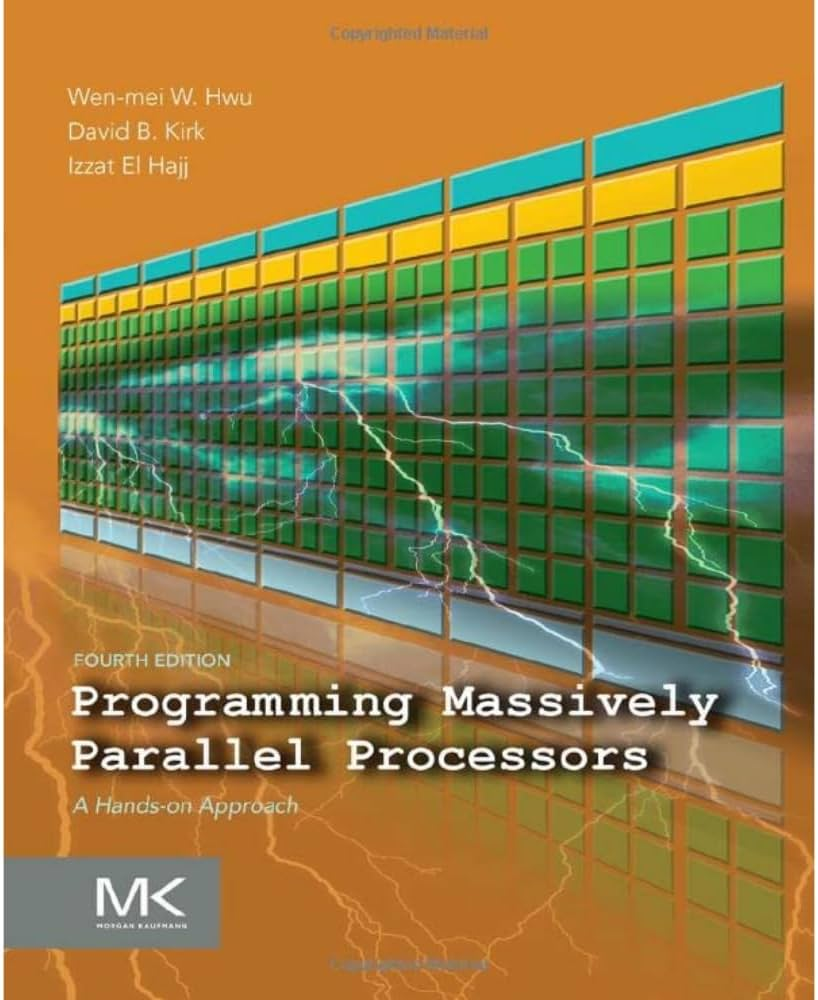

# Programming Massively Parallel Processors: Complete solutions



The following repo contains the complete answers to all the (in)famous Programming Massively Parallel Processors by David Kirk and Wen-mei Hwu. We present the complete set of answers for all chapters for Edition 4 of the book. Each chapter is organized as follows:

```
├── code
│   ├── ...
└── README.md
```

With code containing the code needed to replicate the examples mentioned in the chapter and `README.md` containing details on how to run the said code and also the detailed answers for the questions. For every answer, we try to include a "chain of thought" so that it is easier to follow and understand the argumentation and conclusions. 

## Where to find solutions by chapter

- [Chapter 2](chapter-2/README.md)
- [Chapter 3](chapter-3/README.md)
- [Chapter 4](chapter-4/README.md)
- [Chapter 5](chapter-5/README.md)
- [Chapter 6](chapter-6/README.md)
- [Chapter 7](chapter-7/README.md)
- [Chapter 8](chapter-8/README.md)
- [Chapter 9](chapter-9/README.md)
- [Chapter 10](chapter-10/README.md)
- [Chapter 11](chapter-11/README.md)
- [Chapter 12](chapter-12/README.md)
- [Chapter 13](chapter-13/README.md)
- [Chapter 14](chapter-14/README.md)
- [Chapter 15](chapter-15/README.md)
- [Chapter 16](chapter-16/README.md)
- [Chapter 17](chapter-17/README.md)
- [Chapter 18](chapter-18/README.md)
- [Chapter 20](chapter-20/README.md)
- [Chapter 21](chapter-20/README.md)


## Contributing

If you find an error in one of the answers, please open an issue. Ideally the issue should follow the standard below. 
**Describe the bug**
Describe where the problem is and what precisely is wrong.

**Proposed solution**
Here paste your proposed solution. Please include the reasoning behind why you believe your solution is correct.

## Running the code

The codebase assumes you have access to Nvidia hardware and have the NVCC installed. For every chapter, we provide details on how to run the code. Some times it is based on C (usually we give you a make file); other times, for simplicity, we use Python. To configure the Python environment, run the following:


```bash
conda create -n pmpp python=3.11
```

```bash
conda activate pmpp
```

```bash
pip install -r requirements.txt
```
