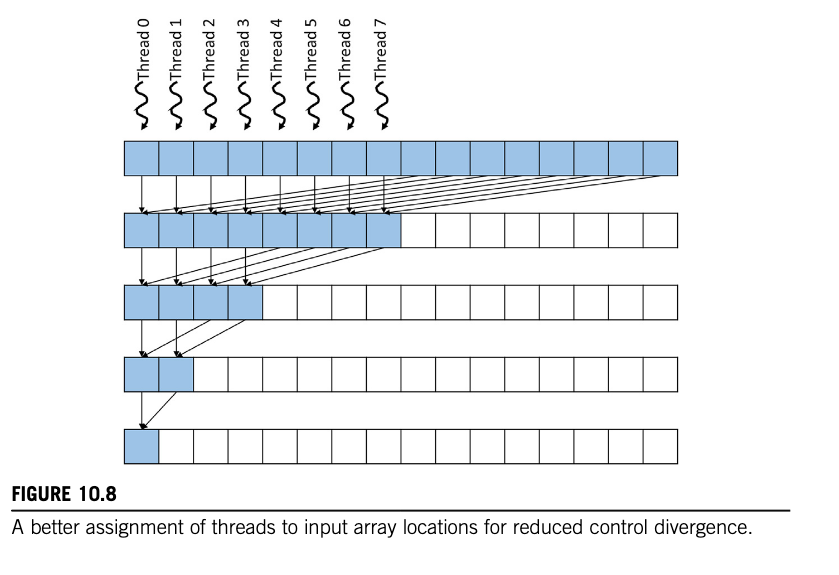
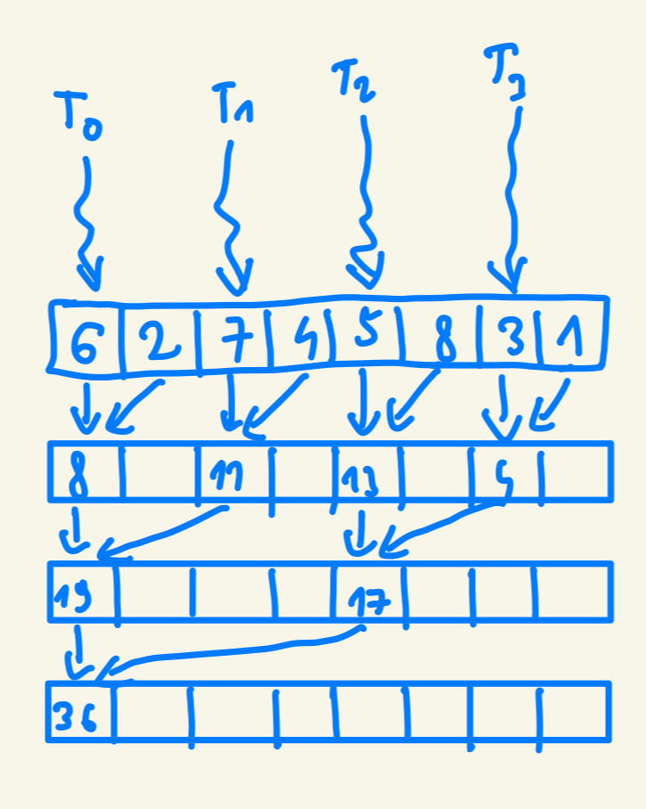

# Chapter 10

## Code

## Exercises

### Exercise 1
**For the simple reduction kernel in Fig. 10.6, if the number of elements is 1024 and the warp size is 32, how many warps in the block will have divergence during the fifth iteration?**

```cpp
__global__ void simple_sum_reduction_kernel(float* input, float* output){
    unsigned int i = 2 * threadIdx.x;

    for (unsigned int stride = 1; stride <= blockDim.x; stride *= 2){
        if (threadIdx.x % stride == 0){
            input[i] += input[i + stride];
        }
        __syncthreads();
    }

    if (threadIdx.x == 0)
        *output = input[0];
}
```

Each thread in the first iteration processes two elements of the array; hence, for an array with 1024 elements, we will have `1024/2 = 512` threads. 

Since the warp size is 32, we will have `512/32 = 16` warps initially. 

- Iteration 1: stride = 1
- Iteration 2: stride = 2
- Iteration 3: stride = 4
- Iteration 4: stride = 8
- Iteration 5: stride = 16

We only run threads that satisfy the following condition: `threadIdx.x % stride == 0` (line 04). Hence, during iteration 5, the threads `0, 16, 32, 48, 64, 80, 96, 112, 128, 144, 160, 176, 192, 208, 224, 240, 256, 272, 288, 304, 320, 336, 352, 368, 384, 400, 416, 432, 448, 464, 480, 496` will be executed. In each warp, two threads will be executed, e.g., in warp 0, threads 0 and 16; in warp 15, threads 480 and 496; etc.—meaning all of our 16 warps will be active and will have the control divergence. 

So the answer is 16 warps will have control divergence. 

### Exercise 2
**For the improved reduction kernel in Fig. 10.9, if the number of elements is 1024 and the warp size is 32, how many warps will have divergence during the fifth iteration?**

```cpp
__global__ void ConvergentSumReductionKernel(float* input, float* output) {
    unsigned int i = threadIdx.x;
    for (unsigned int stride = blockDim.x; stride >= 1; stride /= 2) {
        if (threadIdx.x < stride) {
            input[i] += input[i + stride];
        }
        __syncthreads();
    }
    if(threadIdx.x == 0) {
        *output = input[0];
    }
}
```

As in the **Exercise 1**, we have `512` threads and `16` warps. 

We only run threads that satisfy the following condition: `threadIdx.x < stride`. Let's calculate this.

- Iteration 1: stride = 512
- Iteration 2: stride = 256
- Iteration 3: stride = 128
- Iteration 4: stride = 64
- Iteration 5: stride = 32




The kernel is set up in the way that only the `stride` threads on the left are being executed (see the image above with visualization). So in iteration 5, only 32 of the most left threads are being executed. Since the warp is 32 threads and 32 threads are being executed, there is no control divergence. All the other warps remain inactive, so there is also no control divergence there either. 

So the final answer is: there are no warps with control divergence.

### Exercise 3
**Modify the kernel in Fig. 10.9 to use the access pattern illustrated below**


Original kernel:
```cpp
__global__ void ConvergentSumReductionKernel(float* input, float* output) {
    unsigned int i = threadIdx.x;
    for (unsigned int stride = blockDim.x; stride >= 1; stride /= 2) {
        if (threadIdx.x < stride) {
            input[i] += input[i + stride];
        }
        __syncthreads();
    }
    if(threadIdx.x == 0) {
        *output = input[0];
    }
}
```

Modified:

```cpp
__global__ void covergent_sum_reduction_kernel_reversed(float* input, float* output){
    unsigned int i = threadIdx.x + blockDim.x;
    for (unsigned int stride = blockDim.x; stride >= 1; stride /= 2){
        //stride iterations remains the same, but we just use it to index the previous input to be taken
        if (blockDim.x - threadIdx.x <= stride){
            input[i] += input[i - stride];
        }
        __syncthreads();
    }
    //take it from the last input
    if (threadIdx.x == blockDim.x-1){
        *output = input[i];
    }
}
```

The `covergent_sum_reduction_kernel_reversed` kernel can be found implemented and tested in [reduction_sum_2048.cu](code/reduction_sum_2048.cu).

### Exercise 4
**Modify the kernel in Fig. 10.15 to perform a max reduction instead of a sum reduction.**

```cpp
__global__ void CoarsenedMaxReductionKernel(float* input, float* output) {
    __shared__ float input_s[BLOCK_DIM];
    unsigned int segment = COARSE_FACTOR*2*blockDim.x*blockIdx.x;
    unsigned int i = segment + threadIdx.x;
    unsigned int t = threadIdx.x;
    float maximum_value = input[i];
    for(unsigned int tile = 1; tile < COARSE_FACTOR*2; ++tile) {
        maximum_value = fmax(maximum_value, input[i + tile*BLOCK_DIM]);
    }
    input_s[t] = maximum_value;

    for (unsigned int stride = blockDim.x/2; stride >= 1; stride /= 2){
        __syncthreads();
        if (t < stride) {
            input_s[t] = fmax(input_s[t], input_s[t + stride]);
        }
    }
    if (t == 0) {
        atomicExch(output, fmax(*output, input_s[0]));
    }
}
```

### Exercise 5
**Modify the kernel in Fig. 10.15 to work for an arbitrary length input that is not necessarily a multiple of `COARSE_FACTOR*2*blockDim.x`. Add an extra parameter N to the kernel that represents the length of the input.**

```cpp
__global__ void coarsed_sum_reduction_kernel(float* input, float* output, int length){
    __shared__ float input_s[BLOCK_DIM];
    unsigned int segment = COARSE_FACTOR*2*blockDim.x*blockIdx.x;
    unsigned int i = segment + threadIdx.x;
    unsigned int t = threadIdx.x;
    
    float sum = 0.0f;
    //we only execute this part if is is within an array, otherwise sum=0
    if (i < length){
        sum = input[i];
    
        for(unsigned int tile = 1; tile < COARSE_FACTOR*2; ++tile) {
            //only add the ones actually in the array
            if (i + tile*BLOCK_DIM < length) {
                sum += input[i + tile*BLOCK_DIM];
            }
        }
    }

    input_s[t] = sum;
    
    for (unsigned int stride = blockDim.x/2; stride >= 1; stride /= 2){
        __syncthreads();
        if (t < stride) {
            input_s[t] += input_s[t + stride];
        }
    }
    if (t == 0) {
        atomicAdd(output, input_s[0]);
    }
}
```

The `coarsed_sum_reduction_kernel` can be found implemented and tested in [reduction_sum.cu](code/reduction_sum.cu).

### Exercise 6
**Assume that parallel reduction is to be applied on the following input array:**

`[6, 2, 7, 4, 5, 8, 3, 1]`

**Show how the contents of the array change after each iteration if:**

**a. The unoptimized kernel in Fig. 10.6 is used.**. 



**b. The kernel optimized for coalescing and divergence in Fig. 10.9 is used.**

