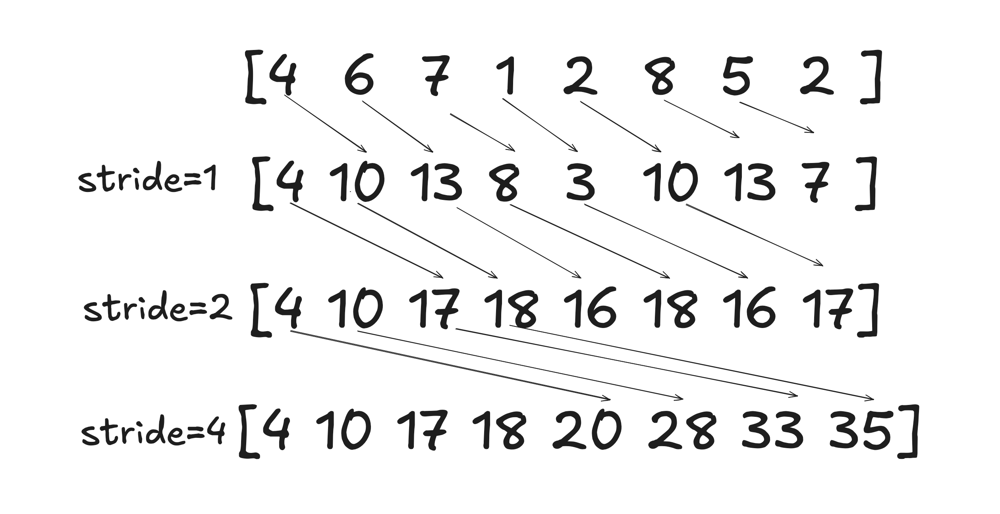

# Chapter 11

## Code

We implement all of the kernels described in this chapter. This includes being

- Kogge-Stone scan
- Kogge-Stone with double buffering scan
- Brent-Kung scan
- Three-phase scan

The above implementations are located in [scan.cu](code/scan.cu). To execute the code, run:

```bash
nvcc scan.cu -o scan
./scan
```

We also implemented the hierarchical kernel, capable of processing arrays of arbitrary length, and we benchmarked it against the traditional sequential scan kernel. Additionally, we implemented a kernel with a domino-like synchronization mechanism between the blocks. The implementation can be found in [hierarchical_scan.cu](code/hierarchical_scan.cu). 

To execute the code, run:

```bash
nvcc hierarchical_scan.cu -o hierarchical_scan
./hierarchical_scan
```

The output should resemble this:

```bash
Benchmarking Scan Operations
----------------------------
Size       Sequential(ms)  Hierarchical(ms) Domino(ms)      Speedup-H  Speedup-D  Match   
16384      0.002           0.135           0.135           0.01       0.01       ✓✓
65536      0.088           0.196           0.220           0.45       0.40       ✓✓
262144     0.790           0.521           0.589           1.52       1.34       ✓✓
1048576    3.537           1.582           2.114           2.24       1.67       ✓✓
```

## Exercises


### Exercise 1
**Consider the following array: [4 6 7 1 2 8 5 2]. Perform a parallel inclusive prefix scan on the array, using the Kogge-Stone algorithm. Report the intermediate states of the array after each step.**



### Exercise 2
**Modify the Kogge-Stone parallel scan kernel in Fig. 11.3 to use double-buffering instead of a second call to `__syncthreads()` to overcome the write-after-read race condition.**

We implemented and tested this kernel in [scan.cu](code/scan.cu). The kernel itself looks like that:

```cpp
__global__ void kogge_stone_scan_kernel_with_double_buffering(float *X, float *Y, unsigned int N){
    extern __shared__ float shared_mem[];
    float* buffer1 = shared_mem;
    float* buffer2 = &shared_mem[N];

    unsigned int tid = threadIdx.x;

    float *src_buffer = buffer1;
    float *trg_buffer = buffer2;

    if (tid < N){
        src_buffer[tid] = X[tid];
    }
    else{
        src_buffer[tid] = 0.0;
    }
    for (unsigned int stride = 1; stride < blockDim.x; stride *= 2){
        __syncthreads();
        //no need for two __syncthreads();
        if (tid >= stride) {
            trg_buffer[tid] = src_buffer[tid] + src_buffer[tid - stride];
        } else {
            trg_buffer[tid] = src_buffer[tid];
        }
        
        float* temp;
        temp = src_buffer;
        src_buffer = trg_buffer;
        trg_buffer = temp;
    }

    if (tid < N){
        Y[tid] = src_buffer[tid];
    }
}
```

### Exercise 3
**Analyze the Kogge-Stone parallel scan kernel in Fig. 11.3. Show that control divergence occurs only in the first warp of each block for stride values up to half of the warp size. That is, for warp size 32, control divergence will occur 5 iterations for stride values 1, 2, 4, 8, and 16.**

```cpp
01  __global__ void Kogge_Stone_scan_kernel(float *X, float *Y, unsigned int N){
02      shared float XY[SECTION_SIZE];
03      unsigned int i = blockIdx.x*blockDim.x + threadIdx.x;
04      if(i < N) {
05          XY[threadIdx.x] = X[i];
06      } else {
07          XY[threadIdx.x] = 0.0f;
08      }
09      for(unsigned int stride = 1; stride < blockDim.x; stride *= 2) {
10          syncthreads();
11          float temp;
12          if(threadIdx.x >= stride)
13              temp = XY[threadIdx.x] + XY[threadIdx.x-stride];
14          syncthreads();
15          if(threadIdx.x >= stride)
16              XY[threadIdx.x] = temp;
17      }
18      if(i < N) {
19          Y[i] = XY[threadIdx.x];
20      }
21  }
```

Let's go through this in a step-by-step manner. 

**For stride 1**: We will execute threads with `threadIdx.x >=`1`—so all of the threads in the block, but thread 0 will be executed. Meaning we will have control divergence only in warp 0, covering the threads `[0, 31]`. In all of the other warps in the block that cover threads `[32, 47], [48, 79], ... [991, 1023]`, all threads will execute the line 13 and line 16 instructions. 

**For stride 2**: We will execute threads with `threadIdx.x >= 2`, so all of the threads in the block, but thread 0 and thread 1, will be executed. Meaning we will have control divergence only in warp 0, covering the threads `[0, 31]`. In all of the other warps in the block that cover threads `[32, 47], [48, 79], ... [991, 1023]`, all threads will execute the line 13 and line 16 instructions. 

**For stride 4**: We will execute threads with `threadIdx.x >= 4`, so all of the threads in the block, but the threads 0, 1, 2, and 3 will be executed. Meaning we will have control divergence only in warp 0, covering the threads `[0, 31]`. As above, all of the other threads will be executed, so none of the other warps will have control divergence. 


**For stride 8**: We will execute threads with `threadIdx.x >= 8`, so all of the threads in the block, but the threads 0, 1, 2, 3, 4, 5, 6, 7 will be executed. Meaning we will have control divergence only in warp 0, covering the threads `[0, 31]`. As above, all of the other threads will be executed, so none of the other warps will have control divergence. 

**For stride 16**: We will execute threads with `threadIdx.x >= 16`, so all of the threads in the block, but the threads 0, 1, 2, 3, 4, 5, 6, 7, 8, 9, 10, 11, 12, 13, 14, 15 will be executed. Rest same as above. 

**For stride 32** Here it finally gets more interesting.  We will execute threads with `threadIdx.x >=`32`—meaning all threads in warp 0, covering the threads `[0, 31]`, will be inactive—so there will be no control divergence. The first thread index in warp 1 is ``32`—so in this thread, all of the threads in the warp, including the first thread, will be executed. Same for every following warp. There will be no control divergence there. 

... the same will apply for **stride=64**—the first two warps skipped all of the other fully executed, **stride=128**, etc. 

So all only in the first 5 iterations will there be control divergence. 

*Here we assume that the block size is of max size of 1024, but in principle this will work exactly the same for even smaller blocks. 


### Exercise 4
**For the Kogge-Stone scan kernel based on reduction trees, assume that we have 2048 elements. Which of the following gives the closest approximation of how many add operations will be performed?**

I think we lack some part of this question here, but let's try to answer anyway. In the Kogge-Stone algorithm we will do two operations, per active thread per stride, addition—line 13—and saving to the buffer—line 16. We will try to calculate how many threads will be active throughout the execution of the kernel and multiply it by two operations to get the total number of operations. 

Let's start by figuring out how many threads will be operating. We have 2048 elements; each thread processes a single element. Blocks can have at most 1024 elements, so we will have 2 blocks with 1024 threads each. Let's analyze now how many threads will be active per block.

**For stride 1**: All of the threads but the thread `0` will be executed (see Exercise 3 to see why). So we will have 1023 active threads. 

**For stride 2**: All of the threads but the threads `0, 1` will be executed. So we will have 1022 active threads. 

**For stride 4**: All of the threads but the threads `0, 1, 2, 3` will be executed. So we will have 1020 active threads. 

**For stride 8**: All of the threads but the threads `0, 1, 2, 3, 4, 5, 6, 7` will be executed. So we will have `1016` active threads. 

**For stride 16**: All of the threads but the threads `[0, 15]` will be executed. So we will have `1008` active threads. 

**For stride 32**: We will have `992` active threads. 

**For stride 64**: We will have `960` active threads. 

**For stride 128**: We will have `896` active threads. 

**For stride 256**: We will have `768` active threads. 

**For stride 512**: We will have `512` active threads. 

**For stride 1024**: There will be no active threads since none satisfy the condition `threadIdx.x >= 1024`—the` last `threadIdx.x` in each block is `1023`.

Let's combine these now: `1023 + 1022 + 1020 + 1016 + 1008 + 992 + 896 + 768 + 512 = 8257` active threads in total. Times two blocks times two operations per thread per stride, it takes us to the total of `8257 x 2 x 2 = 33028` operations.


### Exercise 5
**Consider the following array: [4 6 7 1 2 8 5 2]. Perform a parallel inclusive prefix scan on the array, using the Brent-Kung algorithm. Report the intermediate states of the array after each step.**

### Exercise 6
**For the Brent-Kung scan kernel, assume that we have 2048 elements. How many add operations will be performed in both the reduction tree phase and the inverse reduction tree phase?**

### Exercise 7
**Use the algorithm in Fig. 11.4 to complete an exclusive scan kernel.**

### Exercise 8
**Complete the host code and all three kernels for the segmented parallel scan algorithm in Fig. 11.9.**

The implementation can be found in [hierarchical_scan.cu](code/hierarchical_scan.cu). We implemented both, the version with extra array `S` for storing the block sums and the version with the domino-like synchronization mechanism between the blocks. The latter below:

```cpp
// Single-kernel domino-style scan implementation
__global__ void hierarchical_kogge_stone_domino(
    float *X,          
    float *Y,          
    float *scan_value, 
    int *flags,        
    int *blockCounter, 
    unsigned int N     
) {
    extern __shared__ float buffer[];
    __shared__ unsigned int bid_s;
    __shared__ float previous_sum;
    
    const unsigned int tid = threadIdx.x;
    
    // DEADLOCK PREVENTION: Dynamic block index assignment
    if (tid == 0) {
        bid_s = atomicAdd(blockCounter, 1);
    }
    __syncthreads();
    
    const unsigned int bid = bid_s;
    const unsigned int gid = bid * blockDim.x + tid;

    // Phase 1: Local block scan using Kogge-Stone
    if (gid < N) {
        buffer[tid] = X[gid];
    } else {
        buffer[tid] = 0.0f;
    }

    // Kogge-Stone scan within block
    for (unsigned int stride = 1; stride < blockDim.x; stride *= 2) {
        __syncthreads();
        float temp = buffer[tid];
        if (tid >= stride) {
            temp += buffer[tid - stride];
        }
        __syncthreads();
        buffer[tid] = temp;
    }

    // Store local result
    if (gid < N) {
        Y[gid] = buffer[tid];
    }

    // Get local sum for this block
    const float local_sum = buffer[blockDim.x - 1];

    // Phase 2: Inter-block sum propagation
    if (tid == 0) {
        if (bid > 0) {
            // Wait for previous block's flag
            while (atomicAdd(&flags[bid], 0) == 0) { }
            
            // Get sum from previous block
            previous_sum = scan_value[bid];
            
            // Add local sum and propagate
            const float total_sum = previous_sum + local_sum;
            scan_value[bid + 1] = total_sum;
            
            // Ensure scan_value is visible
            __threadfence();
            
            // Signal next block
            atomicAdd(&flags[bid + 1], 1);
        } else {
            // First block just propagates its sum
            scan_value[1] = local_sum;
            __threadfence();
            atomicAdd(&flags[1], 1);
        }
    }
    __syncthreads();

    // Phase 3: Add previous block's sum to local results
    if (bid > 0 && gid < N) {
        Y[gid] += previous_sum;
    }
}
```