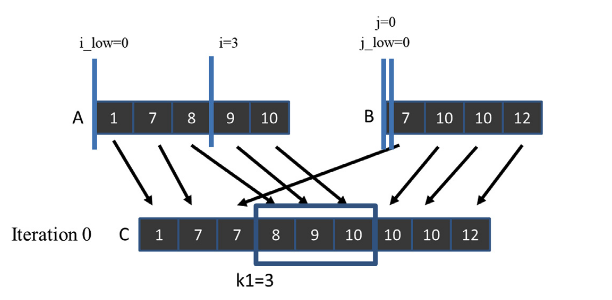

# Chapter 12

## Code

We implement `merge_sequential`, `simple_merge_parallel_gpu` and `merge_parallel_with_tiling_gpu` mentioned in the chapter. To run the benchmark comparing the execution speed run:

```bash
nvcc merge_bench.cu -o merge_bench
./merge_bench
```

We run the benchmark for two arrays of arbitrary lengths.

## Exercises

### Exercise 1

**Assume that we need to merge two lists A=(1, 7, 8, 9, 10) and B=(7, 10, 10, 12). What are the co-rank values for C[8]?**

Let's first recall what the `co_rank` function tells us—we use it to derive the beginning position of the subarrays `A` and `B` that will be used to merge into the subarray `C` starting at `k`. Let's first realize the final, merged array: `[1, 7, 7, 8, 9, 10, 10, 12]`. 

We see that the subarray starting at `8` will consist of only a single element—`12` taken from the array `B`. So the subarray `A` starts at index `5`-we don't take a single element, and for the subarray `B`, it starts at index `k-i = 8-5=3`, so it will consist of a single element `B[3]= 12`.

Now let's execute the `co_rank(8, A, 5, B, 4)`

```cpp
int co_rank(int k, int* A, int m, int* B, int n) {
    int i = k < m ? k : m; // i = min(k,m)
    int j = k - i;
    int i_low = 0 > (k-n) ? 0 : k-n; // i_low = max(0,k-n)
    int j_low = 0 > (k-m) ? 0 : k-m; // i_low = max(0,k-m)
    int delta;
    bool active = true;
    while(active) {
        if (i > 0 && j < n && A[i-1] > B[j]) {
            delta = ((i - i_low +1) >> 1) ; // ceil(i-i_low)/2)
            j_low = j;
            j = j + delta;
            i = i - delta;
        } else if (j > 0 && i < m && B[j-1] >= A[i]) {
            delta = ((j - j_low +1) >> 1) ;
            i_low = i;
            i = i + delta;
            j = j - delta;
        } else {
            active = false;
        }
    }
    return i;
}
```

Iteration 0 
```
i = min(k,m) = min(8,5) = 5
j = k - i = 8 - 5 = 3
i_low = max(0,k-n) = max(0,8-4) = max(0,4) = 4
j_low = max(0,k-m) = max(0,8-5) = max(0,3) = 3

m = 5
n = 4
```

First if `i>0✅ && j<n ✅ && A[4] > B[3]❌`

Second if `j>0 && i < m ❌`

So we execute the third if—ending the loop, returning `5`. So we ended up on the same value as in the intuitive explanation.

### Exercise 2

**Complete the calculation of co-rank functions for thread 2 in Fig. 12.6.**



Thread 2 starts at k=6, so we need to calculate `co_rank(6, A, 5, B, 4)`.  Intuitively, we see that the subarray `C[6:]` takes as an input nothing from the array `A` and three elements, starting at `1`, from array `B`. Hence, we expect the `co_rank` to be `5`, so that we know that we should take nothing from array `A` and start at `B[1]` for array `B`.

Let's now analyze it step by step:

```
m = 5
n = 4

i = min(k,m) = min(6,5) = 5
j = k - i = 6 - 5 = 1
i_low = max(0,k-n) = max(0,6-4) = max(0,2) = 2
j_low = max(0,k-m) = max(0,6-5) = max(0,1) = 1
```

First if `i>0✅ && j<n ✅ && A[4] > B[1]❌`

Second if `j>0 && i < m ❌`

So we trigger third case finishing the loop, returning `i=5` - same as we conculuded in the intuitive explanation.

### Exercise 3
**For the for-loops that load A and B tiles in Fig. 12.12, add a call to the co- rank function so that we can load only the A and B elements that will be consumed in the current generation of the while-loop.**

```cpp
while(counter < total_iteration){
    // Determine the number of A elements (tileA) needed so that the total of
    // tile_size merged elements is obtained. The remaining tileB elements come from B.
    int tileA = co_rank(tile_size, 
                        A + A_curr + A_consumed, A_length - A_consumed,
                        B + B_curr + B_consumed, B_length - B_consumed);
    int tileB = tile_size - tileA;  // tileB elements from B

    // Load only the needed A elements into shared memory: i + threadIdx.x < tileA
    for(int i = 0; i < tileA; i += blockDim.x) {
        if (i + threadIdx.x < tileA) {
            A_S[i + threadIdx.x] = A[A_curr + A_consumed + i + threadIdx.x];
        }
    }

    // Load only the needed B elements into shared memory: i + threadIdx.x < tileB
    for(int i = 0; i < tileB; i += blockDim.x) {
        if(i + threadIdx.x < tileB) {
            B_S[i + threadIdx.x] = B[B_curr + B_consumed + i + threadIdx.x];
        }
    }
    __syncthreads();
```

### Exercise 4

**Consider a parallel merge of two arrays of size 1,030,400 and 608,000. Assume that each thread merges eight elements and that a thread block size of 1024 is used.**

The resulting array will be of length `1,030,400 + 608,000 = 1,638,400` elements. 

**a. In the basic merge kernel in Fig. 12.9, how many threads perform a binary search on the data in the global memory?**

```cpp
__global__ void merge_basic_kernel(int* A, int m, int* B, int n, int* C) {
    int tid = blockIdx.x*blockDim.x + threadIdx.x;
    int elementsPerThread = ceil((m+n)/(blockDim.x*gridDim.x));
    int k_curr = tid*elementsPerThread; // start output index
    int k_next = min((tid+1)*elementsPerThread, m+n); // end output index
    int i_curr = co_rank(k_curr, A, m, B, n);
    int i_next = co_rank(k_next, A, m, B, n);
    int j_curr = k_curr - i_curr;
    int j_next = k_next - i_next;
    merge_sequential(&A[i_curr], i_next-i_curr, &B[j_curr], j_next-j_curr, &C[k_curr]);
}
```

Since we have `1,638,400` elements, and we know that each thread is merging `8` elements, we will need `1638400 / 8 = 204800` threads. The data after the block size is irrelevant here. The kernel will be executed by every single thread in the grid, so it `204800` will be executing it.

**b. In the tiled merge kernel in Figs. 12.11 - 12.13, how many threads perform a binary search on the data in the global memory?**

```cpp
01  __global__ void merge_tiled_kernel(int* A,int m, int* B, int n, int* C, int tile_size) {
    /* shared memory allocation */
02      extern __shared__ int shareAB[];
03      int * A_S = &shareAB[0];                       // shareA is first half of shareAB
04      int * B_S = &shareAB[tile_size];               // shareB is second half of shareAB
05      int C_curr = blockIdx.x * ceil((m+n)/gridDim.x); // start point of block's C subarray
06      int C_next = min((blockIdx.x+1) * ceil((m+n)/gridDim.x), (m+n)); // ending point

07      if (threadIdx.x ==0){
08          A_S[0] = co_rank(C_curr, A, m, B, n); // Make block-level co-rank values visible
09          A_S[1] = co_rank(C_next, A, m, B, n); // to other threads in the block
10      }
11      __syncthreads();
12      int A_curr  = A_S[0];
13      int A_next  = A_S[1];
14      int B_curr = C_curr - A_curr;
15      int B_next  = C_next - A_next;
16      __syncthreads();
```

For the merge_tiled_kernel we only perform a binary search twice per block—in lines `08` and `09` to calculate the beginning and the end of the block. Then all of the binary searches are done using the shared memory.

We need to find out how many blocks we run (gridSize.x). We know that each thread merges `8` elements and that the block size is—hence,1024 each block merges `8 x 1024 = 8192` elements. The number of blocks in the grid is then `1638400 / 8192 = 20`. Since we have `200` blocks in the grid and one thread per block is doing the binary search, we have `200 x 1 = 200` threads doing the binary search on global memory.


**c. In the tiled merge kernel in Figs. 12.11 - 12.13, how many threads perform a binary search on the data in the shared memory?**

```cpp
17  int counter = 0;                                    //iteration counter
18  int C_length = C_next - C_curr;
19  int A_length = A_next - A_curr;
20  int B_length = B_next - B_curr;
21  int total_iteration = ceil((C_length)/tile_size);   //total iteration
22  int C_completed = 0;
23  int A_consumed = 0;
24  int B_consumed = 0;
25  while(counter < total_iteration){
26      /* loading tile-size A and B elements into shared memory */
27      for(int i=0; i<tile_size; i+=blockDim.x){
28          if( i + threadIdx.x < A_length - A_consumed) {
29              A_S[i + threadIdx.x] = A[A_curr + A_consumed + i + threadIdx.x ];
30          }
31      }
32      for(int i=0; i<tile_size; i+=blockDim.x) {
33          if(i + threadIdx.x < B_length - B_consumed) {
34              B_S[i + threadIdx.x] = B[B_curr + B_consumed + i + threadIdx.x];
35          }
36      }
37      __syncthreads();
37      int c_curr  = threadIdx.x    *  (tile_size/blockDim.x);
38      int c_next = (threadIdx.x+1) * (tile_size/blockDim.x);
39      c_curr = (c_curr <= C_length - C_completed) ? c_curr : C_length - C_completed;
40      c_next = (c_next <= C_length - C_completed) ? c_next : C_length - C_completed;
41      /* find co-rank for c_curr and c_next */
        int a_curr = co_rank(c_curr, A_S, min(tile_size, A_length-A_consumed),
42                                    B_S, min(tile_size, B_length-B_consumed));
43      int b_curr = c_curr - a_curr;
        int a_next = co_rank(c_next, A_S, min(tile_size, A_length-A_consumed),
44                                    B_S, min(tile_size, B_length-B_consumed));
45      int b_next = c_next - a_next;

        /* All threads call the sequential merge function */
46      merge_sequential (A_S+a_curr, a_next-a_curr, B_S+b_curr, b_next-b_curr,
                         C+C_curr+C_completed+c_curr);
47      /* Update the number of A and B elements that have been consumed thus far */
48      counter ++;
49      C_completed += tile_size;
50      A_consumed += co_rank(tile_size, A_S, tile_size, B_S, tile_size);
51      B_consumed = C_completed - A_consumed;
52      __syncthreads();
    }
```

As we shown in **4b** there are total of `200` blocks, each with `1024` threads. Each thread is responsible for merging `8 elements` and we can see each thread executing the binary search in the shared memory **three** times, in lines `41`, `43` and `50`. Hence we have `200 x 1024 = 204800` threads executing the binary search in shared memory.
