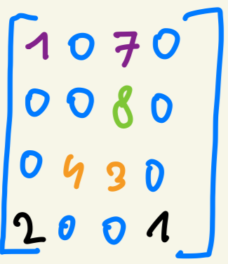
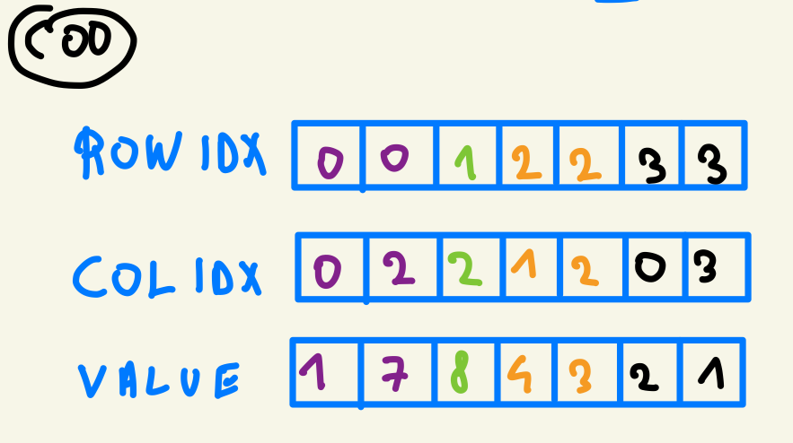
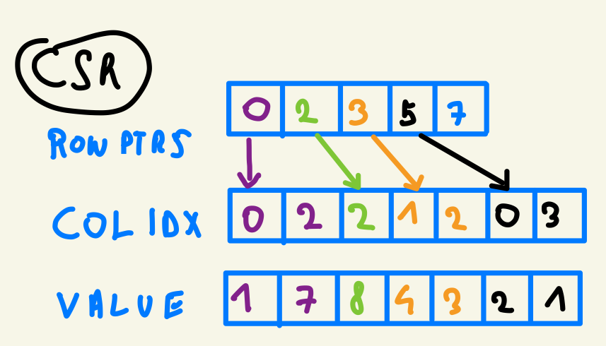
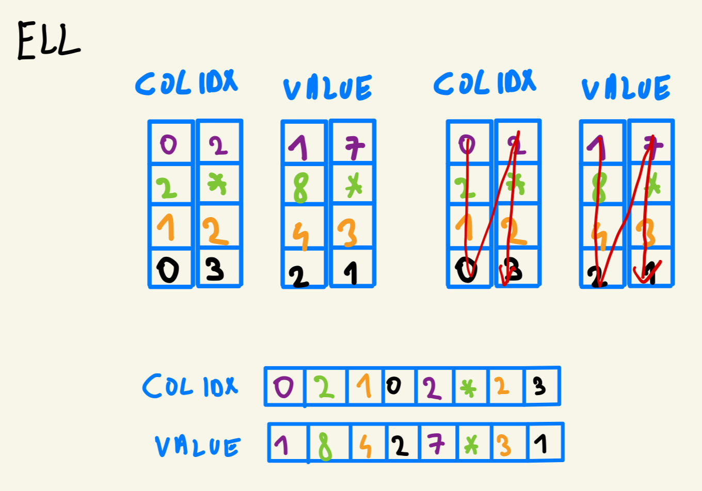
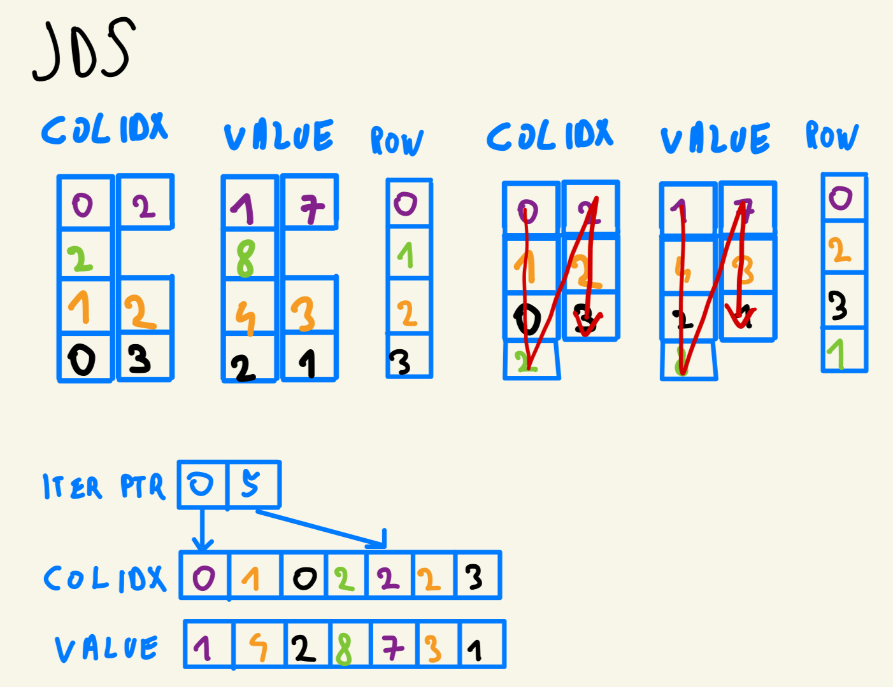

# Chapter 14

## Code

We implement all of the spmv methods mentioned in Chapter 14, in particular:

- [COO](code/coo.cu)

- [CSR](code/csr.cu)

- [ELL](code/ell.cu)

- [Hybrid ELL—COO](code/ell_coo_hybrid.cu)

- [JDS](code/jds.cu)

To run the programs use Makefile we provide

```bash
make
```

You should see something like:

```bash
Compiling coo.cu -> coo...
✓ Successfully compiled coo
Compiling coo_to_csr.cu -> coo_to_csr...
✓ Successfully compiled coo_to_csr
Compiling csr.cu -> csr...
✓ Successfully compiled csr
Compiling ell_coo_hybrid.cu -> ell_coo_hybrid...
✓ Successfully compiled ell_coo_hybrid
Compiling ell.cu -> ell...
✓ Successfully compiled ell
Compiling jds.cu -> jds...
✓ Successfully compiled jds
=========================================
Build complete! Programs compiled:
  - coo
  - coo_to_csr
  - csr
  - ell_coo_hybrid
  - ell
  - jds
=========================================
Usage examples:
  ./coo            - Run COO SpMV
  ./csr            - Run CSR SpMV
  ./ell            - Run ELL SpMV
  ./jds            - Run JDS SpMV
  ./coo_to_csr     - Run COO to CSR conversion
  ./ell_coo_hybrid - Run Hybrid ELL-COO SpMV
=========================================
```

Now you can run any program that you are interested in. 

## Exercises

### Exercise 1

**Consider the following sparse matrix:**

```
1 0 7 0
0 0 8 0
0 4 3 0
2 0 0 1
```

**Represent it in each of the following formats: (1) COO, (2) CSR, (3) ELL, and (4) JDS.**



**COO**



**CSR**



**ELL**



**JDS**



```
### Exercise 2

**Given a sparse matrix of integers with m rows, n columns, and z nonzeros, how many integers are needed to represent the matrix in (1) COO, (2) CSR, (3) ELL, and (4) JDS? If the information that is provided is not enough to allow an answer, indicate what information is missing.**

**COO**
We need `z` integers for `rowidx` the array,`z` integers for the `colidx` array, and `z` integers for the values. So `3z` integers in total to represent the matrix.

**CSR**

We need `z` integers for `colidx` array, `z` integers for `value` array and we need to store `m+1` pointers in `rowptrs` array. So the total of `z + z + m + 1` integers. 

**ELL**

We don't have enough information to fully estimate how many integers we need. In `ELL` we pad the rows to match the length to the longest row. Here we lack the information on how many integers are in the longest one.

Assuming that all of the rows would be the same (no padding), we would need `z` integers for `colidx` array and `z` integers for values array — so `2z` integers in total. In practice, we will need `2z + padding` integers.

**JDS**

Here we also lack some crucial information, namely how many non zero numbers are in the row with the most non-zero numbers. We need this information to know how many integers we need to store in the `iterptr` array. 

Assuming that we have the same number of non-zero numbers in each row, we would have `z/m + 1` integers row in each row. We would need `z/m + 1` integers for `iterptr`, `z` integers for `colidx` array, and `z` integers for `value` array. So `z + z + z/m + 1` integers in total. 


Here we also lack some crucial information, namely how many non-zero numbers are in the row with the most non-zero numbers. We need this information to know how many integers we need to store in the `iterptr` array.

Assuming that we have the same number of non-zero numbers in each row, we would have z/m + 1 integers in each row. We would need `z/m + 1` integers for `iterptrz` array, `z` integers for `colidx` array, and `z` integers for `value` array. So `z + z + z/m + 1` integers in total.


### Exercise 3

**Implement the code to convert from COO to CSR using fundamental parallel computing primitives, including histogram and prefix sum.**

We implement the conversion code in [coo_to_csr.cu](code/coo_to_csr.cu).

```cpp
void cooToCsr(int nnz, int numRows, int *h_rowIdx, int *h_colIdx, float *h_values, 
                int **d_csrRowPtrs, int **d_csrColIdx, float **d_csrValues) {
    int *d_rowIdx, *d_colIdx;
    float *d_values; 

    cudaMalloc(&d_rowIdx, nnz * sizeof(int));
    cudaMalloc(&d_colIdx, nnz * sizeof(int));
    cudaMalloc(&d_values, nnz * sizeof(float));

    cudaMalloc(d_csrRowPtrs, (numRows + 1) * sizeof(int));
    cudaMalloc(d_csrColIdx, nnz * sizeof(int));
    cudaMalloc(d_csrValues, nnz * sizeof(float));

    cudaMemcpy(d_rowIdx, h_rowIdx, nnz * sizeof(int), cudaMemcpyHostToDevice);
    cudaMemcpy(d_colIdx, h_colIdx, nnz * sizeof(int), cudaMemcpyHostToDevice);
    cudaMemcpy(d_values, h_values, nnz * sizeof(float), cudaMemcpyHostToDevice);
    cudaMemset(*d_csrRowPtrs, 0, (numRows + 1) * sizeof(int));

    int blockSize = 256;
    int gridSize = (nnz + blockSize - 1) / blockSize;

    computeHistogram<<<gridSize, blockSize>>>(nnz, d_rowIdx, *d_csrRowPtrs);
    cudaDeviceSynchronize();

    exclusiveScan<<<1, numRows + 1>>>(*d_csrRowPtrs, numRows);
    cudaDeviceSynchronize();

    cudaMemcpy(*d_csrColIdx, d_colIdx, nnz * sizeof(int), cudaMemcpyDeviceToDevice);
    cudaMemcpy(*d_csrValues, d_values, nnz * sizeof(float), cudaMemcpyDeviceToDevice);

    cudaFree(d_rowIdx);
    cudaFree(d_colIdx);
    cudaFree(d_values);
}
```

### Exercise 4

**Implement the host code for producing the hybrid ELL-COO format and using it to perform SpMV. Launch the ELL kernel to execute on the device, and compute the contributions of the COO elements on the host.**

Please find the implementation of `spMV` in `ELL-COO` format in [](ell_coo_hybrid.cu).

### Exercise 5

**Implement a kernel that performs parallel SpMV using a matrix stored in the JDS format.**

Please fine the implementation of `smMV` in `JDS` format in [jds.cu](code/jds.cu).

```cpp
struct JDSMatrix {
    int numRows;
    int numCols;
    int numTiles;
    int* colIdx;
    float* values;
    int* rowPerm;
    int* iterPtr;
};

__global__ void spmv_jds_kernel(JDSMatrix jdsMatrix, float* x, float* y) {
    unsigned int tid = blockIdx.x * blockDim.x + threadIdx.x;
    if (tid >= jdsMatrix.numRows) return;
    
    float sum = 0.0f;
    for (int t = 0; t < jdsMatrix.numTiles; ++t) {
        int i = jdsMatrix.iterPtr[t] + tid;
        if (i < jdsMatrix.iterPtr[t + 1]) {
            int col = jdsMatrix.colIdx[i];
            float value = jdsMatrix.values[i];
            sum += x[col] * value;
        }
    }
    y[jdsMatrix.rowPerm[tid]] = sum;
}
```