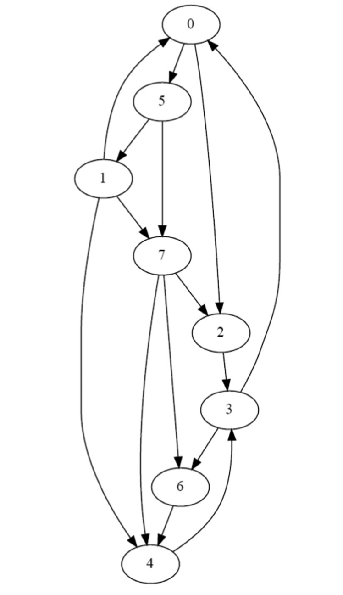
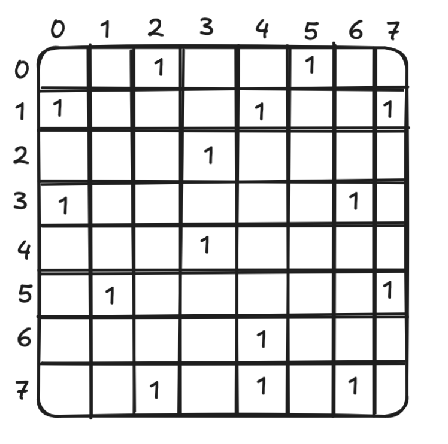
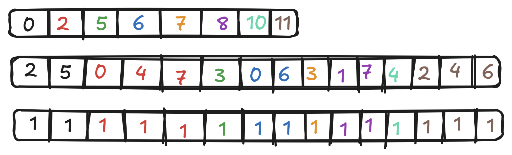

# Chapter 15

## Code

## Exercises

### Exercise 1

**Consider the following directed unweighted graph:**

**a. Represent the graph using an adjacency matrix.**

**b. Represent the graph in the CSR format. The neighbor list of each vertex must be sorted.**

**Parallel BFS is executed on this graph starting from vertex 0 (i.e., vertex 0 is in level 0). For each iteration of the BFS traversal:**

**i. If a vertex-centric push implementation is used:**

### Iteration 1

**How many threads are launched?**

We have 8 vertices - hence 8 threads and launched. 

**How many threads iterate over their vertex’s neighbors?**

Only vertex 0 will iterate over its neighbours, so only 1 thread. 

### Iteration 2

**How many threads are launched?**

We have 8 vertices - hence 8 threads and launched. 

**How many threads iterate over their vertex’s neighbors?**

Two threads, for vectex `5` and for vertex `2` will iterate over their neighbouts. 

### Iteration 3

**How many threads are launched?**

Same as above, 8 vertices - 8 threads. 

**How many threads iterate over their vertex’s neighbors?**

Now we have three vertices at level 2: `1`, `7` and `3`, so three vertices will iterate over their neighbours. 

### Iteration 4

**How many threads are launched?**

Again, 8 vertices - 8 threads. 

**How many threads iterate over their vertex’s neighbors?**

We have two vertices at level 3: `4` and `6` - so two threads will iterate. 

This is also the last iteration, all of the vertices are already visited so, no new vertices will be added and none of the therads will set flag `newVertexVisited` to 1. 

**ii. If a vertex-centric pull implementation is used:**

### Iteration 1
**How many threads are launched?**

We have 8 verices so we lanuch 8 threads. 

**How many threads iterate over their vertex’s neighbors?**

7 threads - all but thread for vertex `0` will iterate over its neighbours. 

**How many threads label their vertex?**

Two threads, for vertex `5` and for vertex `2` will label their vertex.

### Iteration 2
**How many threads are launched?**

We have 8 verices so we lanuch 8 threads. 

**How many threads iterate over their vertex’s neighbors?**

5 threads, for vertices `1`, `7`, `6`, `3`, `4` will iterate over their neighbours. 

**How many threads label their vertex?**

3 threads, for vertex `1`, `7`, and `3` will label their vertex. 

### Iteration 3
**How many threads are launched?**

Yet again - 8 vertices 8 threads lanuched. 

**How many threads iterate over their vertex’s neighbors?**

2 threads, for vertex `6`, and for vertex `4` will iterate over their neighbours. 

**How many threads label their vertex?**

Two threads will label their vertex. 

### Iteration 4

**How many threads are launched?**

Yet again - 8 vertices 8 threads lanuched. 

**How many threads iterate over their vertex’s neighbors?**

None, at this point we don't have any more unvisited vertices. 

**How many threads label their vertex?**

As above - none. This is also our last iteration as none of the threads will set flag `newVertexVisited` to 1. 

**iii If an edge-centric implementation is used:**

### Iteration 1

**How many threads are launched?**

We have 15 edges between the vertices, so 15 threads.

**How many threads may label a vertex?**

Two threads, for edge `0 -> 5` and for for edge `0 -> 2`, label their vertex. 

### Iteration 2

**How many threads are launched?**

Again, we have 15 edges so we launch 15 threads. 

**How many threads may label a vertex?**

Three threads, for edge `5 -> 1`, `5 -> 7` and `2 -> 3`

### Iteration 3

**How many threads are launched?**

Again, we have 15 edges so we launch 15 threads. 

**How many threads may label a vertex?**

Four threads, for edges `3 -> 6`, `7 -> 6`, `1 -> 4`, `7 -> 4`, note that two of these operations are ***impotent*** as they don't really change the label assigned to the vertex. 

### Iteration 4

**How many threads are launched?**

Again, we have 15 edges so we launch 15 threads. 

**How many threads may label a vertex?**

0, we have 2 vertices at level 3, but all its neighbours were already visited, hence none thread will label a vertex. This is also our last iteration, as none of the threads will modify the flag `newVertexVisited`

**iv. If a vertex-centric push frontier-based implementation is used:**

We assume that iteration 1 will start with `[0]` in `prevFrontier`.

### Iteration 1
**How many threads are launched?**

We launch only 1 thread for vertex 0.

**How many threads iterate over their vertex’s neighbors?**

Only one thread iterate over their vertex neighbours. We add `[5, 2]` to `currFrontier`. 

### Iteration 2
**How many threads are launched?**

We have two elements in `prevFrontier`, so two threads are launched. 

**How many threads iterate over their vertex’s neighbors?**

Two threads, for vertices `5` and `2` are iterating over their vetex neighbours. We add `[1, 7, 3]` to `currFrontier`. 

### Iteration 3
**How many threads are launched?**

We have three elements in `prevFrontier`, so three threads are launched. 

**How many threads iterate over their vertex’s neighbors?**

Three threads, for vertices `1`, `7` and `3`, are iterting over their vertex neighbours. We add `[4, 6]` to the `currFrontier`, not that depending on which thread will access it first `6` will be added either by thread for vertex `3` or a thread for vertex `7`.

### Iteration 4
**How many threads are launched?**

Two elements in `prevFrontier` - `[4, 6]`, so two threads are launched. 

**How many threads iterate over their vertex’s neighbors?**

Two of them, but there is no vertices that are still not visited, hence no will be added to the `currFrontier`, which will signal to the function that we don't need to launch the grid anymore. 

### Exercise 2

**Implement the host code for the direction-optimized BFS implementation described in Section 15.3**

### Exercise 3

**Implement the single-block BFS kernel described in Section 15.7.**