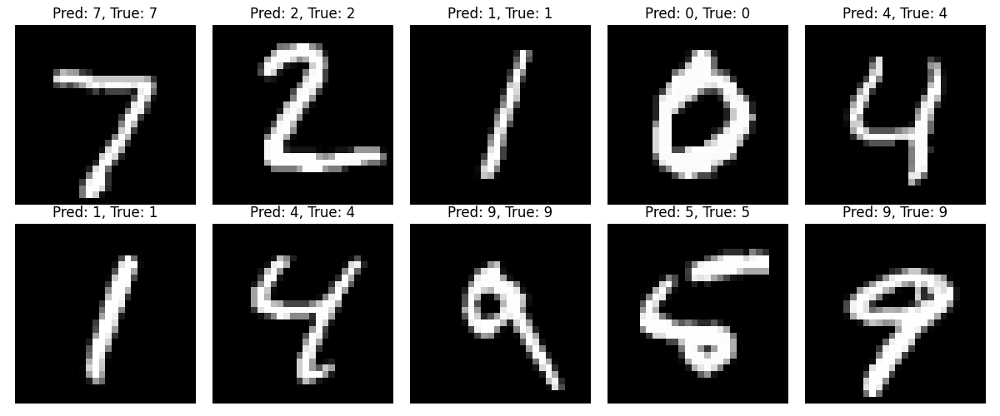

# Chapter 16

## Code

"For learning purposes, we implement several techniques described in the chapter. Specifically, we implement the sequential implementations of backward pass and pooling, and more importantly, we implement a minimal version of an autograd system. 

### Autograd - manual implementation

The most interesting component we implement as part of this chapter is, for sure, the manual implementation of the auto-grad engine. 

Following the subchapters `Training models` and `Convolutional neural network backpropagation` we implement the forward and backward passes for the `Linear`, `Conv2D` and `MaxPooling2D` layers. All of the layers implement the following interface:

```py
class Layer:
    def forward(self, x):
        raise NotImplementedError

    def backward(self, grad_output):
        raise NotImplementedError

    def parameters(self):
        return []

    def __call__(self, x):
        return self.forward(x)
```

For each layer, we implement a backward pass function that, given the output gradient,
- calculates the gradients for all of the parameters
- calculates the gradient for the input and returns it so it can be consumed by the previous layer

For forward and backward passes, we wrap the CUDA code, cuBLAS matmul for the linear layer, and a custom Conv2d forward for the `Conv2D` and `MaxPooling2D` layers. 


We implement two simple training examples:

- [xor](./code/autograd_manual/examples/xor_example.py): training a simple 2-layer neural network on the xor problem
- [mnist](./code/autograd_manual/examples/mnist_example.py): training a simple CNN on MNIST achieving ~98% accuracy in 3 epochs

You can run either of these just by running `main.py` with `--xor` or `--mnist` flag. We don't use any PyTorch training code to show how Autograd works under the hood. It is pretty neat how little is needed to implement a backprop and to train decent image classification models. 

In order to be able to run the code you will need to compile our forward and backward passes. To do so run the [Makefile](./code/autograd_manual/Makefile).

```bash
cd code/autograd_manual

make
```

#### XOR

```bash
python main.py --xor

Successfully loaded cuBLAS wrapper library
cuBLAS initialized successfully
Successfully loaded conv2dcuda wrapper library
Using CUDA kernel implementation (no cuDNN)
Running XOR example with CUDA acceleration...
Starting training...
Epoch [100/1000], Loss: 0.000844
Epoch [200/1000], Loss: 0.000272
Epoch [300/1000], Loss: 0.000154
Epoch [400/1000], Loss: 0.000110
Epoch [500/1000], Loss: 0.000078
Epoch [600/1000], Loss: 0.000075
Epoch [700/1000], Loss: 0.000046
Epoch [800/1000], Loss: 0.000043
Epoch [900/1000], Loss: 0.000035
Epoch [1000/1000], Loss: 0.000033

Final predictions:
Input => Output (Expected)
[0.0, 0.0] => 0.0047 (0.0)
[0.0, 1.0] => 0.9951 (1.0)
[1.0, 0.0] => 0.9951 (1.0)
[1.0, 1.0] => 0.0026 (0.0)

Training complete!
Final loss: 3.339664181112312e-05
XOR example completed successfully
cuBLAS cleaned up successfully
Cleaning up CUDA kernel implementation (no cuDNN)
Cleaned up cuBLAS and cuDNN resources
```


#### MNIST

```bash
python main.py --mnist

Successfully loaded cuBLAS wrapper library
cuBLAS initialized successfully
Successfully loaded conv2dcuda wrapper library
Using CUDA kernel implementation (no cuDNN)
Running MNIST CNN example with CUDA acceleration...
Loading MNIST data using torchvision...
Loaded 60000 training samples and 10000 test samples
Starting training...
Epoch [1/3], Step [187/938], Loss: 0.5718, Accuracy: 83.53%
Epoch [1/3], Step [374/938], Loss: 0.3654, Accuracy: 89.40%
Epoch [1/3], Step [561/938], Loss: 0.2840, Accuracy: 91.70%
Epoch [1/3], Step [748/938], Loss: 0.2352, Accuracy: 93.08%
Epoch [1/3], Step [935/938], Loss: 0.2039, Accuracy: 93.97%
Epoch [1/3] completed, Loss: 0.2034, Accuracy: 93.98%
Epoch [2/3], Step [187/938], Loss: 0.0632, Accuracy: 98.02%
Epoch [2/3], Step [374/938], Loss: 0.0628, Accuracy: 98.03%
Epoch [2/3], Step [561/938], Loss: 0.0580, Accuracy: 98.16%
Epoch [2/3], Step [748/938], Loss: 0.0568, Accuracy: 98.24%
Epoch [2/3], Step [935/938], Loss: 0.0569, Accuracy: 98.24%
Epoch [2/3] completed, Loss: 0.0569, Accuracy: 98.24%
Epoch [3/3], Step [187/938], Loss: 0.0419, Accuracy: 98.65%
Epoch [3/3], Step [374/938], Loss: 0.0401, Accuracy: 98.68%
Epoch [3/3], Step [561/938], Loss: 0.0387, Accuracy: 98.74%
Epoch [3/3], Step [748/938], Loss: 0.0383, Accuracy: 98.74%
Epoch [3/3], Step [935/938], Loss: 0.0383, Accuracy: 98.76%
Epoch [3/3] completed, Loss: 0.0382, Accuracy: 98.76%

Testing the model...
Test Accuracy: 98.74%

Showing some example predictions...
MNIST CNN example completed successfully
cuBLAS cleaned up successfully
Cleaning up CUDA kernel implementation (no cuDNN)
Cleaned up cuBLAS and cuDNN resources
```




### Autograd (leveraging torch)

We also implement a minimal version of this leveraging the `torch` autograd. We show what a minimal interface a class needs to implement for it to be possible to be used with torch autograd.

```py
class LinearFunction(Function):
    @staticmethod
    def forward(ctx, input, weight, bias=None):
        ctx.save_for_backward(input, weight, bias)
        output = input.matmul(weight.t())
        if bias is not None:
            output += bias.unsqueeze(0).expand_as(output)
        return output

    @staticmethod
    def backward(ctx, grad_output):
        input, weight, bias = ctx.saved_tensors
        grad_input = grad_weight = grad_bias = None
        
        if ctx.needs_input_grad[0]:
            # dL/dx = dL/doutput * d(output)/dx = dL/doutput * W 
            grad_input = grad_output.matmul(weight)
            
        if ctx.needs_input_grad[1]:
            # dL/dW = dL/doutput * d(output)/dW = X^T * dL/doutput
            grad_weight = grad_output.t().matmul(input)
            
        if bias is not None and ctx.needs_input_grad[2]:
            # dL/db = sum(dL/doutput)
            # Sum over batch dimension since bias is added to each sample
            grad_bias = grad_output.sum(0)
            
        return grad_input, grad_weight, grad_bias
```

We implement the above to provide a better intuition into how Torch works under the hood (the backward method is crucial).

### Pooling

For exercise 1, we implement the sequential pooling layer:

```bash
cd code/pooling

python setup.py build_ext --inplace

python main.py
```

```bash
=== Testing Pooling Implementation ===
Testing Max Pooling...
Max Pooling - Maximum Difference: 0.0

Testing Average Pooling...
Average Pooling - Maximum Difference: 0.0

✓ Tests passed!

=== Performance Benchmarks ===

Input size: [2, 16, 32, 32]
Max Pooling - Custom: 0.058ms, PyTorch: 0.002ms
Avg Pooling - Custom: 0.002ms, PyTorch: 0.001ms

Input size: [8, 64, 128, 128]
Max Pooling - Custom: 82.433ms, PyTorch: 9.454ms
Avg Pooling - Custom: 47.322ms, PyTorch: 3.836ms
```

### Conv2D backward

For exercise 4, we implement the sequential conv2d backward, and we verify its performance with torch implementation.

```bash

cd code/conv2d_backward

python main.py
```

The output should be something like:

```bash
PyTorch gradient shape: (3, 28, 28)
Our gradient shape: (3, 28, 28)
Maximum absolute difference: 2.86102294921875e-06
Average absolute difference: 3.000727701873984e-07
Results match: True

=== Running multiple tests with different configurations ===

Testing with M=2, C=3, H_in=5, W_in=5, K=3
Results match: True, Max difference: 9.5367431640625e-07

Testing with M=4, C=3, H_in=10, W_in=10, K=3
Results match: True, Max difference: 2.86102294921875e-06

Testing with M=2, C=1, H_in=7, W_in=5, K=3
Results match: True, Max difference: 9.5367431640625e-07

Testing with M=3, C=2, H_in=8, W_in=8, K=5
Results match: True, Max difference: 2.86102294921875e-06

Testing with M=1, C=3, H_in=6, W_in=6, K=2
Results match: True, Max difference: 4.76837158203125e-07
```

## Exercises

### Exercise 1

**Implement the forward pass for the pooling layer described in Section 16.2.**

We implement this function in [pooling.c](./code/pooling/pooling.c). See [Pooling](#code-pooling)

```cpp
void poolingLayer_forward(int M, int H, int W, int K, float* Y, float* S, const char* pooling_type) {
    for(int m = 0; m < M; m++)              // for each output feature map
        for(int h = 0; h < H/K; h++)        // for each output element,
            for(int w = 0; w < W/K; w++) {  // this code assumes that H and W
                // Initialize based on pooling type
                if(strcmp(pooling_type, "max") == 0)
                    S[m*(H/K)*(W/K) + h*(W/K) + w] = -FLT_MAX;  // For max pooling
                else
                    S[m*(H/K)*(W/K) + h*(W/K) + w] = 0.0f;      // For avg pooling
                
                // Loop over KxK input window
                for(int p = 0; p < K; p++) {
                    for(int q = 0; q < K; q++) {
                        float val = Y[m*H*W + (K*h + p)*W + (K*w + q)];
                        
                        if(strcmp(pooling_type, "max") == 0) {
                            // Max pooling
                            if(val > S[m*(H/K)*(W/K) + h*(W/K) + w])
                                S[m*(H/K)*(W/K) + h*(W/K) + w] = val;
                        }
                        else {
                            // Average pooling (same as original)
                            S[m*(H/K)*(W/K) + h*(W/K) + w] += val / (K*K);
                        }
                    }
                }
            }
}
```

### Exercise 2

**We used an [N x C x H x W] layout for input and output features. Can we reduce the memory bandwidth by changing it to an [N x H x W x C] layout? What are potential benefits of using a [C x H x W x N] layout?**

### Exercise 3

**Implement the backward pass for the convolutional layer described in Section 16.2.**

You can find the implementation in [conv_ops.c](./code/conv2d_backward/conv_ops.c). See 

```cpp
void convLayer_backward_x_grad(int M, int C, int H_in, int W_in, int K,
 float* dE_dY, float* W, float* dE_dX) {
    int H_out = H_in - K + 1;
    int W_out = W_in - K + 1;
    
    // Initialize dE_dX to zeros
    for(int c = 0; c < C; c++)
        for(int h = 0; h < H_in; h++)
            for(int w = 0; w < W_in; w++)
                dE_dX[c * H_in * W_in + h * W_in + w] = 0;
    
    // Compute gradients
    for(int m = 0; m < M; m++)
        for(int h_out = 0; h_out < H_out; h_out++)
            for(int w_out = 0; w_out < W_out; w_out++)
                for(int c = 0; c < C; c++)
                    for(int p = 0; p < K; p++)
                        for(int q = 0; q < K; q++) {
                            int h_in = h_out + p;
                            int w_in = w_out + q;
                            dE_dX[c * H_in * W_in + h_in * W_in + w_in] += 
                                dE_dY[m * H_out * W_out + h_out * W_out + w_out] * 
                                W[m * C * K * K + c * K * K + p * K + q];
                        }
}
```

### Exercise 4

**Analyze the read access pattern to X in the unroll_Kernel in Fig. 16.18 and show whether the memory reads that are done by adjacent threads can be coalesced.**

```cpp
__global__ void
unroll_Kernel(int C, int H, int W, int K, float* X, float* X_unroll) {
    int t = blockIdx.x * blockDim.x + threadIdx.x;
    int H_out = H - K + 1;
    int W_out = W - K + 1;
    // Width of the unrolled input feature matrix
    int W_unroll = H_out * W_out;
    if (t < C * W_unroll) {
        // Channel of the input feature map being collected by the thread
        int c = t / W_unroll;
        // Column index of the unrolled matrix to write a strip of
        // input elements into (also, the linearized index of the output
        // element for which the thread is collecting input elements)
        int w_unroll = t % W_unroll;
        // Horizontal and vertical indices of the output element
        int h_out = w_unroll / W_out;
        int w_out = w_unroll % W_out;
        // Starting row index for the unrolled matrix section for channel c
        int w_base = c * K * K;
        for(int p = 0; p < K; p++)
            for(int q = 0; q < K; q++) {
                // Row index of the unrolled matrix for the thread to write
                // the input element into for the current iteration
                int h_unroll = w_base + p*K + q;
                X_unroll[h_unroll, w_unroll] = X[c, h_out + p, w_out + q];
            }
    }
}
```

Let's start by linearizing the memory read operation. For `X_unroll` we apply a standard row-major order so it becomes:

```
X_unroll[h_unroll][w_unroll] = X_unroll[(h_unroll * W_unroll) + w_unroll]
```

Now `X`:

```cpp
X[c][h_out + p][w_out + q] = X[(c * H * W) + ((h_out + p) * W) + (w_out + q)]
```

In the kernel `t` is used to calculate:

- `c = t / W_unroll`
- `w_unroll = t % W_unroll`
- `h_out = w_unroll / W_out`
- `w_out = w_unroll % W_out`

When `t` increases by 1 (as in the neighboring kernels), the following happens:

#### Case 1 - `c` doesn't change

In this case:
- `w_unroll` increases by 1
- if `w_out < W_out - 1`, then `w_out` increases by 1 and `h_out` stays the same.
- else if `w_out == W_out - 1`, then `w_out` wraps to 0 and`h_out` increases by 1.

**When w_out increases by 1:**
The memory address changes by:

```cpp
t: (c * H * W) + ((h_out + p) * W) + (w_out + q)
t+1: = (c * H * W) + ((h_out + p) * W) + (w_out + q + 1)
```

The difference is exactly 1, so we get a perfectly coalesced memory access.

**When w_out wraps and h_out increases:**

```cpp
t: (c * H * W) + ((h_out + p) * W) + (W_out - 1 + q)
t+1: (c * H * W) + ((h_out + p + 1) * W) + (0 + q)
```

The difference is:

```cpp
((h_out + p + 1) * W) + q - ((h_out + p) * W) - (W_out - 1 + q)
= W - (W_out - 1) = W - W_out + 1 = W - (W - K + 1) + 1 = K
```

Since `W_out = W - K + 1`

So the memory addresses differ by `K` elements, which is typically a small number (filter size). If `K` is small (e.g., `3` or `5`), some coalescing benefit might still be achieved, but it's not ideal.


#### Case 2 - `c` changes - different channels

The memory access for `t+1` changes by approximately `H x W` (an entire channel), which is typically a lot, so there will be no coalescing.


#### In general 3 cases:

1. Same channel, same row (perfect coalescing): When adjacent threads access elements with the same `h_out` but consecutive `w_out` values.

2. Same channel, row boundary (partial coalescing): When threads move from the end of one row to the beginning of the next row (`w_out` wraps, `h_out` increments), the stride is `K`, which might allow some coalescing if `K` is small and aligned.

3. Channel boundary (no coalescing): When threads move between different channels, the stride is very large.

For a typical CNN used in image processing, it should work really, really well. 


1. Same channel, same row (perfect coalescing): This happens for consecutive threads processing adjacent output pixels in the same row. For each row, we have `W_out` consecutive positions (`W_out = W-K+1`). For an `224×224` image with `3×3` filters, `W_out = 222`. This means `222` consecutive threads will have perfect coalescing per row.

2. Same channel, row boundary (partial coalescing): This happens once per row, with a stride of `K` (typically `3` or `5`). For an `224×224` image, this happens `223` times per channel (once per row transition).

3. Channel boundary (no coalescing): This happens once every `W_unroll` threads, where `W_unroll = H_out × W_out`. For a `224×224` image with `3×3` filters, `W_unroll = 222 × 222 ≈ 49,284`, so this happens much less frequently (`1/49284`).

- Perfect coalescing: Approximately `222 * 224` = `49,728` threads per channel
- Partial coalescing: Approximately `223` threads per channel
- No coalescing: Occurs once per channel

The vast majority of memory accesses (`>99%`) will fall into the perfect coalescing category when processing typical image sizes. 