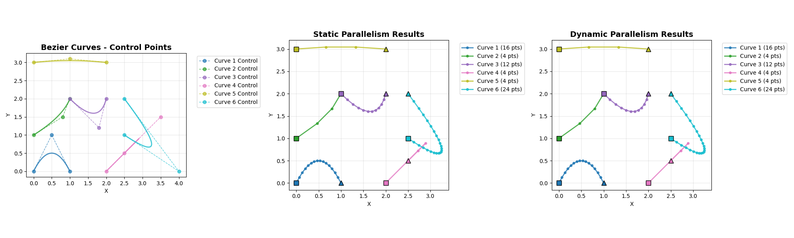
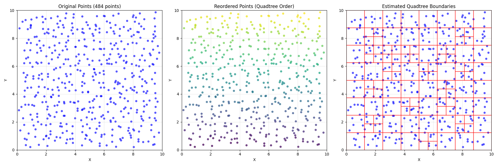

# Chapter 21

## Code

We implement the two dynamic parallel examples mentioned in this chapter, Bezier curves and quadtrees. We implement both of them based on the example presented in the book, and for both of them we attach the host code. 

We also provide the Python files showing the effects of running the algorithm with some benchmarking and little visualizations. 

Note that due to the dynamic parallelism, we need to compile in a specific way. 

### Bezier curves

```bash
nvcc -shared -o libbezier.so -lcuda --compiler-options '-fPIC' -rdc=true bezier_curves.cu

python bezier.py
```

```logs
...

============================================================
PERFORMANCE BENCHMARK
============================================================

Benchmarking with 100 curves:
  Static:  1.069 ms
  Dynamic: 1.342 ms
  Speedup: 0.80x (Static faster)

Benchmarking with 500 curves:
  Static:  5.261 ms
  Dynamic: 5.732 ms
  Speedup: 0.92x (Static faster)

Benchmarking with 1000 curves:
  Static:  10.552 ms
  Dynamic: 11.184 ms
  Speedup: 0.94x (Static faster)
Displaying comparison visualization...
```



### Quadtree

```bash
nvcc -shared -Xcompiler -fPIC -o quadtrees.so quadtrees.cu -rdc=true -lcudadevrt

python quadtree_visualizer.py
```



## Exercises

### Exercise 1
**Which of the following statements are true for the Bezier curves example?**
```cpp
01  struct BezierLine {
02      float2 CP[3];        //Control points for the line
03      float2 *vertexPos;   //Vertex position array to tessellate into
04      int nVertices;       //Number of tessellated vertices
05  };
06  __global__ void computeBezierLines_parent(BezierLine *bLines, int nLines) {
07      //Compute a unique index for each Bezier line
08      int lidx = threadIdx.x + blockDim.x*blockIdx.x;
09      if(lidx < nLines){
10          //Compute the curvature of the line
11          float curvature = computeCurvature(bLines);
12
13          //From the curvature, compute the number of tessellation points
14          bLines[lidx].nVertices = min(max((int)(curvature*16.0f),4),MAX_TESS_POINTS);
15          cudaMalloc((void**)&bLines[lidx].vertexPos,
16                     bLines[lidx].nVertices*sizeof(float2));
17
18          //Call the child kernel to compute the tessellated points for each line
19          computeBezierLine_child<<<ceil((float)bLines[lidx].nVertices/32.0f), 32>>>
20              (lidx, bLines, bLines[lidx].nVertices);
21      }
22  }
23  __global__ void computeBezierLine_child(int lidx, BezierLine* bLines,
24                                         int nTessPoints){
25      int idx = threadIdx.x + blockDim.x*blockIdx.x; //Compute idx unique to this vertex
26      if(idx < nTessPoints){
27          float u = (float)idx/(float)(nTessPoints-1);  //Compute u from idx
28          float omu = 1.0f - u;       //Pre-compute one minus u
29          float B3u[3];               //Compute quadratic Bezier coefficients
30          B3u[0] = omu*omu;
31          B3u[1] = 2.0f*u*omu;
32          B3u[2] = u*u;
33          float2 position = {0,0};    //Set position to zero
34          for(int i = 0; i < 3; i++){
35              //Add the contribution of the i'th control point to position
36              position = position + B3u[i] * bLines[lidx].CP[i];
37          }
38          //Assign the value of the vertex position to the correct array element
39          bLines[lidx].vertexPos[idx] = position;
40      }
41  }
42  __global__ void freeVertexMem(BezierLine *bLines, int nLines) {
43      //Compute a unique index for each Bezier line
44      int lidx = threadIdx.x + blockDim.x*blockIdx.x;
45      if(lidx < nLines)
46          cudaFree(bLines[lidx].vertexPos);    //Free the vertex memory for this line
47  }
...
48 int BLOCK_DIM 64;
49 int blocks = (num_lines + BLOCK_DIM-1) / BLOCK_DIM;
50 computeBezierLines_parent<<<blocks, BLOCK_DIM>>>(d_lines, num_lines);
```
**a. If `N_LINES=1024` and `BLOCK_DIM=64`, the number of child kernels that are launched will be 16.**
If `N_LINES=1024` and `BLOCK_DIM=64` it means we will launch `1024/64=16` blocks, each of size 64 - and `16 x 64 = 1024` threads in total, meaning 1024 threads will be true for line 26. 

```cpp
25 int idx = threadIdx.x + blockDim.x*blockIdx.x; //Compute idx unique to this vertex
26 if(idx < nTessPoints){
```

which implies that 1024, not 16, child kernels will be launched. 

**False**

**b. If N_LINES=1024, the fixed-size pool should be reduced from 2048 (the default) to 1024 to get the best performance**
Per subchapter "Pending launch pool configuration":
> As a general recommendation, the size of the fixed-size pool should be set to the expected number of launched grids (if it exceeds the default size).

We will launch 1024 child grids; this is less than the default 2048, but this should not affect our performance, as none of the grids will require the use of a virtualized pool. 

**False**

**c. If N_LINES=1024 and BLOCK_DIM=64 and per-thread streams are used, a total of 16 streams will be deployed.**

```cpp
// Create non-blocking stream
cudaStream_t stream;
cudaStreamCreateWithFlags(&stream, cudaStreamNonBlocking);

//Call the child kernel to compute the tessellated points for each line
computeBezierLine_child<<<ceil((float)bLines[lidx].nVertices/32.0f), 32, 0, stream>>>
    (lidx, bLines, bLines[lidx].nVertices);

// Destroy stream
cudaStreamDestroy(stream);
```

Again, we are launching `1024` threads (see a); each will launch a child grid. If we use the per-thread stream, we will launch a total of `1024` threads. If we did not use the per-thread streams, we would indeed have 16 streams because we launch 16 blocks (see a), and we have a stream per block as per book:

> When a stream is not specified in a kernel call, the default NULL stream in the block is used by all threads. This means that all grids that are launched in the same block will be serialized even if they were launched by different threads

**False**

### Exercise 2
**Consider a two-dimensional organization of 64 equidistant points. It is classified with a quadtree. What will be the maximum depth of the quadtree (including the root node)?**
**a. 21**
**b. 4**
**c. 64**
**d. 16**

Depth 0: 1 block including 64 elements
Depth 1: 4 blocks maximally including each `64/4 = 16` elements
Depth 2: 16 blocks maximally including each `16/4 = 4` elements
Depth 3: 64 blocks maximally including each `4/4 = 1` elements

So the answer is **b**, a depth of 4 (we started from 0).

### Exercise 3
**For the same quadtree, what will be the total number of child kernel launches?**
**a. 21**
**b. 4**
**c. 64**
**d. 16**

Depth 0: 1 block launching 4 children
Depth 1: 4 blocks each launching 4 children
Depth 2: 16 blocks each launching 4 children

`1 + 4 + 16 = 21` child kernel launches. 

**c**

### Exercise 4
**True or False: Parent kernels can define new __constant__ variables that will be inherited by child kernels.**

Constant memory is compile-time defined: Constant variables (declared with __constant__) must be defined at compile time, not runtime. They're part of the compiled kernel image. There's no mechanism for kernels to dynamically create new constant memory variables during execution.

**False**

### Exercise 5
**True or False: Child kernels can access their parents’ shared and local memories.**

As per book:
> The memory that can be accessed by both parent threads and their child grids includes global memory, constant mem- ory, and texture memory. A parent thread should not pass pointers to local mem- ory or shared memory to their child grids because local memory and shared memory are private to the thread and the thread block, respectively.

**False**


### Exercise 6

**Six blocks of 256 threads run the following parent kernel:**

```cpp
__global__ void parent_kernel(int *output, int *input, int *size) {
   // Thread index
   int idx = threadIdx.x + blockDim.x*blockIdx.x;
   
   // Number of child blocks
   int numBlocks = size[idx] / blockDim.x;
   
   // Launch child
   child_kernel<<<numBlocks, blockDim.x>>>(output, input, size);
}
...
parent_kernel<<<6, 256>>>(output, input, size)
```

**How many child kernels could run concurrently?**
**a. 1536**
**b. 256**
**c. 6**
**d. 1**

We launch `6` blocks, `256` threads each. Each thread will launch the child grid `child_kernel`. As per book:
> When a stream is not specified in a kernel call, the default NULL stream in the block is used by all threads. This means that all grids that are launched in the same block will be serialized even if they were launched by different threads

Since we don't specify the separate per-thread streams, all the child grid launches within a block will be serialized, meaning that 6 different blocks will launch concurrently. Within each block 

```cpp
int numBlocks = size[idx] / 256;
child_kernel<<<numBlocks, 256>>>(output, input, size);
```

We launch a grid of size `numBlocks x 256`, so we will have a total of `6 x numBlocks x 256 = 1536 x numBlocks` kernels running concurrently. Based on this, a multiple of `1536` child kernels will be running concurrently. 

So I would say answer a, though it is not 100% clear that it is entirely correct.
