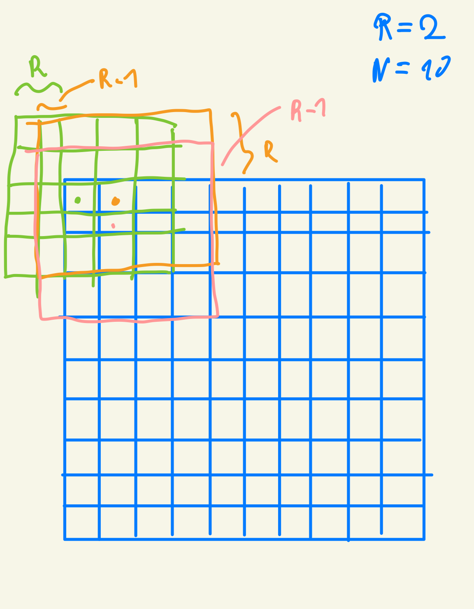
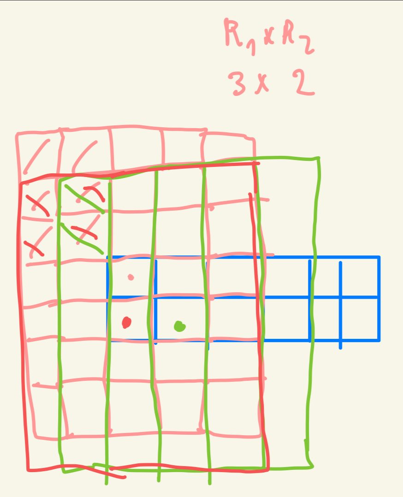

### Exercise 1

**Calculate the P[0] value in Fig. 7.3.**

`x = [0, 0, 8, 2, 5]` `*` `f = [1, 3, 5, 3, 1]` = `[0, 0, 40, 6, 5]` -> `51`

### Exercise 2

**Consider performing a 1D convolution on array N = {4,1,3,2,3} with filter F = {2,1,4}. What is the resulting output array?**

`N_with_ghost_cells = [0, 4, 1, 3, 2, 3, 0]`

`P[0]` = `[0, 4, 1] * [2, 1, 4] = [0, 4, 4] -> 8`
`P[1]` = `[4, 1, 3] * [2, 1, 4] = [8, 1, 12] -> 21`
`P[2]` = `[1, 3, 2] * [2, 1, 4] = [2, 3, 8] -> 13`
`P[3]` = `[3, 2, 3] * [2, 1, 4] = [6, 2, 12] -> 20`
`P[4]` = `[2, 3, 0] * [2, 1, 4] = [4, 3, 0] -> 7`

`P = [8, 21, 13, 20, 7]`

### Exercise 3

**What do you think the following 1D convolution filters are doing?**

**a. [0 1 0]**

A spike detector or peak detector, it isolates each signal from its neighbours. The output signal is effectively the same as the input signal.

**b. [0 0 1]**

[0 0 1] is a right shift kernel - it shifts the entire signal one position to the right. 

**c. [1 0 0]**

[0 0 1] is a left shift kernel - it shifts the entire signal one position to the left. 

**d. [-1/2 0 1/2]**

It is an edge detection kernel - it "fires" is there is a rapid value change between the neigbouring cells. If the cells are similar the values cancel out and it is 0. 

**e. [1/3 1/3 1/3]**

Signal averages the value based on the cell neighbours - we relace the value with the average of its neighborhood. This smoothing effect reduces noise and local variations in the signal by averaging each value with its immediate neighbors.

### Exercise 4

**Consider performing a 1D convolution on an array of size N with a filter of size M:**

**a. How many ghost cells are there in total?** 

The filter is of size `M` or in other words of size `2r + 1`. Meaning `r=(M-1)/2`. There are `r` ghost cells on the left of the array `N` and `r` ghost cells on the right of the array `N` - `2r`in total or `(M-1)/2 * 2 = (M-1)` ghost cells.  

**b. How many multiplications are performed if ghost cells are treated as multiplications (by 0)?**

For each element of the array we perform `M` mutiplications, there are `N` elements in the array so `M*N` multiplications. 

**c. How many multiplications are performed if ghost cells are not treated as multiplications?**

This gets slightly more tricky to calculate. As we showed above, if the ghost cells are treated as multiplication, we have `NxM` multiplications, but now, for the first element of an array, we "loose" `r` multiplications (two on the left); for the second element, we lose `r-1` multiplications; for the third, `r-2`, etc., all the way to `1` for the `r`th element. On the right side, we have the same situation. So overall we have

`NxM - (r + r-1 + r-2 + ... + 1) x 2`. This is a sum of an arithmetic sequence where:

- First term (a₁) = r
- Last term (aₙ) = 1
- Number of terms = r
- Common difference (d) = -1

We can apply the following formula to arithmetic sequences:
Sum = n(a₁ + aₙ)/2, where n is the number of terms. Substituting our values: Sum = `(r)(r + 1)/2 = r(r + 1)/2` on the left and the same on the right. 

So in total, `NxM - (r(r+1)/2) x 2 =  NxM - r(r+1)` multiplications.

This formula makes sense because when `M = 1` (filter size = 1), `r = 0`, so we get NxM multiplications as expected


### Exercise 5
**Consider performing a 2D convolution on a square matrix of size N × N with a square filter of size M × M:**

**a. How many ghost cells are there in total?**

The filter is of size `M` in each direction or in other worlds `M = 2r + 1`. `r = (M-1)/2`. There are `Nxr` ghost cells at each of 4 sides of the matix, so `4xNxr` in total, plus there is `rxr` ghost cells at each corner. So overall there are `4r x (N + r)` ghost cells in total.


**b. How many multiplications are performed if ghost cells are treated as multiplications (by 0)?**

There are `NxN` elements in the matrix. For each element we multiply the filter values by the element and its 
neighbours. Each filter is `MxM` so there is in total `NxN x MxM` multiplications. 


**c. How many multiplications are performed if ghost cells are not treated as multiplications?**

This is pretty tricky to calculate. As we show in **5b**, if we consider the ghost cells to also be multiplication, we will have a total of `NxN x MxM` multiplications. This will be our baseline. If we don't treat ghost cells as multiplications, then we need to offset (reduce) this number by the number of multiplications that won't be conducted. 

To estimate the number of these, let's start by looking at the calculations we did for **4b**. Similarly to the Conv1D example, for each row we would have `MxN` calculations minus `r x (r+1)` multiplications. Now, we have `N` rows, so this "saving" will be multiplied by `N`. Next, we not only have savings along the rows axis, but also across the column axis. So in the end we have savings of `2 x N x r x (r+1)` cells.

 On top of that we need to account for the corner cells. Here it get's slighly complicated. For the mask applied to the cell at the corner, here we "loose" `r x r` operations, for a cell on the row below we "loose" `(r-1) x r` multiplications, for the one on the right we "loose" `r x (r-1)`, for a second cell at the diagonal we "loose" `(r-1) x (r-1)`, etc. 

 We can think about this as a discrete version of such an integral `∫₁ʳ ∫₁ʳ xy dy dx` where we go from 1 to r in both directions. 

We know that `Σ(x=1 to n) x = n(n+1)/2`. 

Therefore `Σ(x=1 to r) Σ(y=1 to r) xy = [Σ(x=1 to r) x][Σ(y=1 to r) y] = = [r(r+1)/2][r(r+1)/2] = [r(r+1)/2]²`

For `r=1` we have 1, for `r=2` we have 9 etc. This makes sense. Remeber that we have 4 corners so we need to multiply it by 4. 
 
Summing it it we have `NxN x MxM` multiplications minus what we loose at the edges (columns and rows so `x 2`) and minus what we loose at the four corners: `NxN x MxM - (2 x N x rx(r+1)) - 4xr(r+1)(2r+1)/6` multiplications. 

 See the visualization:
 


### Exercise 6
**Consider performing a 2D convolution on a rectangular matrix of size N₁ × N₂ with a rectangular mask of size M₁ × M₂:**


**a. How many ghost cells are there in total?**

The mask is of size `M₁ × M₂`. Let's that the notation that it has radius of `r₁` and `r₂`, where `r₁ = (M₁-1)/2` and `r₂=(M₂-1)/2`.    

There are `N₁ x r₂` ghost cells on the left and `N₁ x r₂` cells on the right. There are `N₂ x r₁`ghost cells on the bottom and on top of the matix. So the total of `2 x (N₁ x r₂ + N₂ x r₁)` ghost cells sorrounding the matrix. Than there are also `r₁ x r₂` ghost cells at each of the four corners, bringing it to the total of `2 x (N₁ x r₂ + N₂ x r₁) + 4(r₁ x r₂)` ghost cells. 

**b. How many multiplications are performed if ghost cells are treated as multiplications (by 0)?**

If the ghost celss are treated as mutliplications it is fairly straighforward. We have a total of `N₁ x N₂` cells in the matrix, for each cell we do `M₁ × M₂` mutliplications bringing it to the total of `N₁ x N₂ x M₁ × M₂` multiplications.

**c. How many multiplications are performed if ghost cells are not treated as multiplications?**

This gets even more tricky than the the **5c**. Let's think step by step. 

As we shown in **6b** if ghost cells are treated as multiplications we have a total of `N₁ x N₂ x M₁ × M₂` multiplications, now let's offset it by calculating how much should we substract from this number if we were to not consider the ghost cells as multiplications. 

For each row we need to substract `r₂ x (r₂+1)/2` multiplications on the right and `r₂ x (r₂+1)/2` on the left (same reasoning as in `4c`). We have `N₁` rows so it is total of `N₁ x r₂ x (r₂+1)` operations we need to substract. 

Now we need to do the same for columns. We have `N₂` columns. For each one, on the top of the matrix we need to substract `r₁ x (r₁+1) / 2` multiplications and same for the ghost cells below the matrix. Total of `N₂ x (r₁ x r₁+1)` operations we need to substract. 

Now the truly tricky part, calculating how many multiplications we "loose" at the corners. Similary to what we did in **5c** we can caluclate it as:

`Σ(x=1 to r₁) Σ(y=1 to r₂) [xy] = = [Σ(x=1 to r₁) x][Σ(y=1 to r₂) y] = [r₁(r₁+1)/2][r₂(r₂+1)/2]`

Plus we need to remeber that we have four corners. 


This brings us to the total of:

`N₁ x N₂ x M₁ × M₂ - (N₁ x r₂ x (r₂+1) + N₂ x (r₁ x r₁+1) + [r₁(r₁+1)/2][r₂(r₂+1)/2])` multiplications. 




### Exercise 7
**Consider performing a 2D tiled convolution with the kernel shown in Fig. 7.12 on an array of size N × N with a filter of size M × M using an output tile of size T × T:**

```cpp
01  #define IN_TILE_DIM 32
02  #define OUT_TILE_DIM ((IN_TILE_DIM) - 2*(FILTER_RADIUS))
03  __constant__ float F_c[2*FILTER_RADIUS+1][2*FILTER_RADIUS+1];
04  __global__ void convolution_tiled_2D_const_mem_kernel(float *N, float *P,
05                                                      int width, int height) {
06      int col = blockIdx.x*OUT_TILE_DIM + threadIdx.x - FILTER_RADIUS;
07      int row = blockIdx.y*OUT_TILE_DIM + threadIdx.y - FILTER_RADIUS;
08      //loading input tile
09      __shared__ N_s[IN_TILE_DIM][IN_TILE_DIM];
10      if(row>=0 && row<height && col>=0 && col<width) {
11          N_s[threadIdx.y][threadIdx.x] = N[row*width + col];
12      } else {
13          N_s[threadIdx.y][threadIdx.x] = 0.0;
14      }
15      __syncthreads();
16      // Calculating output elements
17      int tileCol = threadIdx.x - FILTER_RADIUS;
18      int tileRow = threadIdx.y - FILTER_RADIUS;
19      // turning off the threads at the edges of the block
20      if (col >= 0 && col < width && row >=0 && row < height) {
21          if (tileCol>=0 && tileCol<OUT_TILE_DIM && tileRow>=0
22                  && tileRow<OUT_TILE_DIM) {
23              float Pvalue = 0.0f;
24              for (int fRow = 0; fRow < 2*FILTER_RADIUS+1; fRow++) {
25                  for (int fCol = 0; fCol < 2*FILTER_RADIUS+1; fCol++) {
26                      Pvalue += F_c[fRow][fCol]*N_s[tileRow+fRow][tileCol+fCol];
27                  }
28              }
29              P[row*width+col] = Pvalue;
30          }
31      }
32  }
```

**a. How many thread blocks are needed?**

We need to run a block for each output tile. So we run 

`[(N + T - 1)/1, (N + T - 1)/1]` blocks. 

**b. How many threads are needed per block?**

Each block is of size IN_TILE. Since the out tile is of size T, the in tile is `T + 2r`, where `r = (M-1)/2`.

So `(T + (M-1)/2) x (T + (M-1)/2)` threads per block. 

**c. How much shared memory is needed per block?**

Each block needs `IN_TILE x IN_TILE x 4 bytes` for shared memory, so `(T + (M-1)/2) x (T + (M-1)/2) x 4 bytes`   

**d. Repeat the same questions if you were using the kernel in Fig. 7.15.**

Each output tile will have its own block, so for the grid size, nothing changes:

`[(N + T - 1)/1, (N + T - 1)/1]`

But now each block will be of size `T x T`.

and we need to just have shared memory for the output tile and the holo cells we get from the cache memory, so we need `T x T x 4 bytes` of shared memory per block. 


### Exercise 8
**Revise the 2D kernel in Fig. 7.7 to perform 3D convolution.**

```cpp
__global__ void convolution_3D_basic_kernel(float *N, float *F, float *P,
    int r, int width, int height, int depth) {
    int outCol = blockIdx.x*blockDim.x + threadIdx.x;
    int outRow = blockIdx.y*blockDim.y + threadIdx.y;
    int outDepth = blockIdx.z*blockDim.z + threadIdx.z;

    float Pvalue = 0.0f;
    
    for (int fDepth = 0; fDepth < 2*r+1; fDepth++) {
        for (int fRow = 0; fRow < 2*r+1; fRow++) {
            for (int fCol = 0; fCol < 2*r+1; fCol++) {
                int inDepth = outDepth - r + fDepth;
                int inRow = outRow - r + fRow;
                int inCol = outCol - r + fCol;
                
                if (inRow >= 0 && inRow < height && 
                    inCol >= 0 && inCol < width &&
                    inDepth >= 0 && inDepth < depth) {
                    
                    int inIndex = inDepth*width*height + inRow*width + inCol;
                    int fIndex = fDepth*(2*r+1)*(2*r+1) + fRow*(2*r+1) + fCol;
                    
                    Pvalue += F[fIndex] * N[inIndex];
                }
            }
        }
    }
    
    P[outDepth*width*height + outRow*width + outCol] = Pvalue;
}
```


### Exercise 9
**Revise the 2D kernel in Fig. 7.9 to perform 3D convolution.**

```cpp
__global__ void convolution_3D_const_mem_kernel(float *N, float *P, int r,
    int width, int height, int depth) {
    int outCol = blockIdx.x * blockDim.x + threadIdx.x;
    int outRow = blockIdx.y * blockDim.y + threadIdx.y;
    int outDepth = blockIdx.z * blockDim.z + threadIdx.z;
    
    float Pvalue = 0.0f;
    
    for (int fDepth = 0; fDepth < 2*r+1; fDepth++) {
        for (int fRow = 0; fRow < 2*r+1; fRow++) {
            for (int fCol = 0; fCol < 2*r+1; fCol++) {
                int inRow = outRow - r + fRow;
                int inCol = outCol - r + fCol;
                int inDepth = outDepth - r + fDepth;
                
                if (inRow >= 0 && inRow < height && 
                    inCol >= 0 && inCol < width && 
                    inDepth >= 0 && inDepth < depth) {
                    
                    int input_idx = inDepth * height * width + 
                                  inRow * width + 
                                  inCol;
                    int filter_idx = fDepth * (2*r+1) * (2*r+1) + 
                                   fRow * (2*r+1) + 
                                   fCol;
                    
                    Pvalue += F[filter_idx] * N[input_idx];
                }
            }
        }
    }
    
    P[outDepth * height * width + outRow * width + outCol] = Pvalue;
}
```

### Exercise 10
**Revise the tiled 2D kernel in Fig. 7.12 to perform 3D convolution.**

```cpp
#define IN_TILE_DIM 16  // Reduced from 32 due to 3D memory constraints
#define OUT_TILE_DIM ((IN_TILE_DIM) - 2*(FILTER_RADIUS))
__constant__ float F_c[2*FILTER_RADIUS+1][2*FILTER_RADIUS+1][2*FILTER_RADIUS+1];

__global__ void convolution_tiled_3D_const_mem_kernel(float *N, float *P,
                                                    int width, int height, int depth) {
    int col = blockIdx.x*OUT_TILE_DIM + threadIdx.x - FILTER_RADIUS;
    int row = blockIdx.y*OUT_TILE_DIM + threadIdx.y - FILTER_RADIUS;
    int dep = blockIdx.z*OUT_TILE_DIM + threadIdx.z - FILTER_RADIUS;

    __shared__ float N_s[IN_TILE_DIM][IN_TILE_DIM][IN_TILE_DIM];
    
    if(dep>=0 && dep<depth && row>=0 && row<height && col>=0 && col<width) {
        N_s[threadIdx.z][threadIdx.y][threadIdx.x] = N[dep*width*height + row*width + col];
    } else {
        N_s[threadIdx.z][threadIdx.y][threadIdx.x] = 0.0f;
    }
    
    __syncthreads();
    
    int tileCol = threadIdx.x - FILTER_RADIUS;
    int tileRow = threadIdx.y - FILTER_RADIUS;
    int tileDep = threadIdx.z - FILTER_RADIUS;
    
    if (dep >= 0 && dep < depth && row >= 0 && row < height && col >= 0 && col < width) {
        if (tileCol>=0 && tileCol<OUT_TILE_DIM && 
            tileRow>=0 && tileRow<OUT_TILE_DIM &&
            tileDep>=0 && tileDep<OUT_TILE_DIM) {
            
            float Pvalue = 0.0f;
            
            for (int fDep = 0; fDep < 2*FILTER_RADIUS+1; fDep++) {
                for (int fRow = 0; fRow < 2*FILTER_RADIUS+1; fRow++) {
                    for (int fCol = 0; fCol < 2*FILTER_RADIUS+1; fCol++) {
                        Pvalue += F_c[fDep][fRow][fCol] * 
                                 N_s[tileDep+fDep][tileRow+fRow][tileCol+fCol];
                    }
                }
            }
            
            P[dep*width*height + row*width + col] = Pvalue;
        }
    }
}
```

